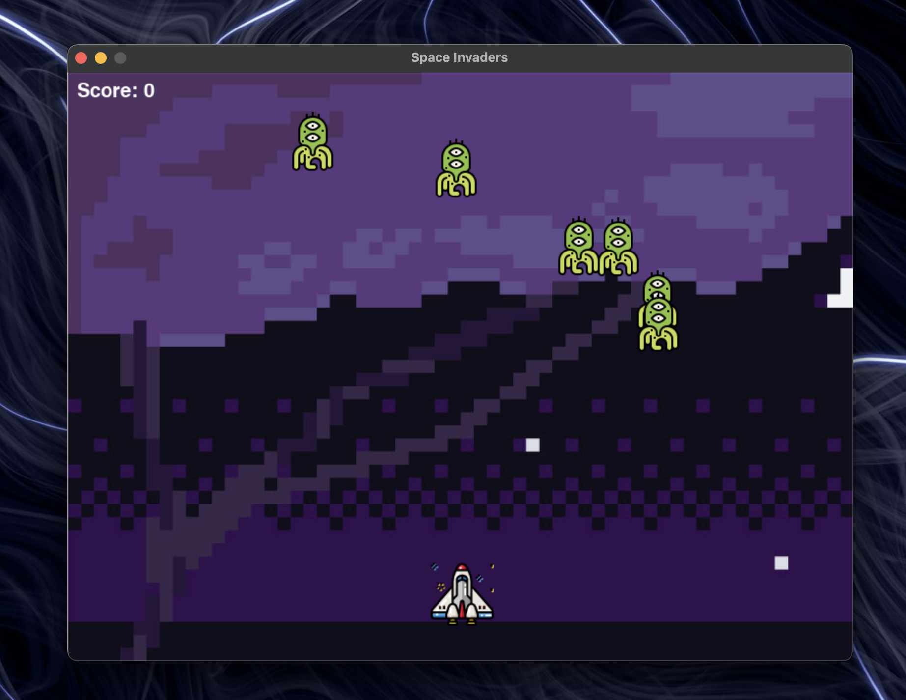
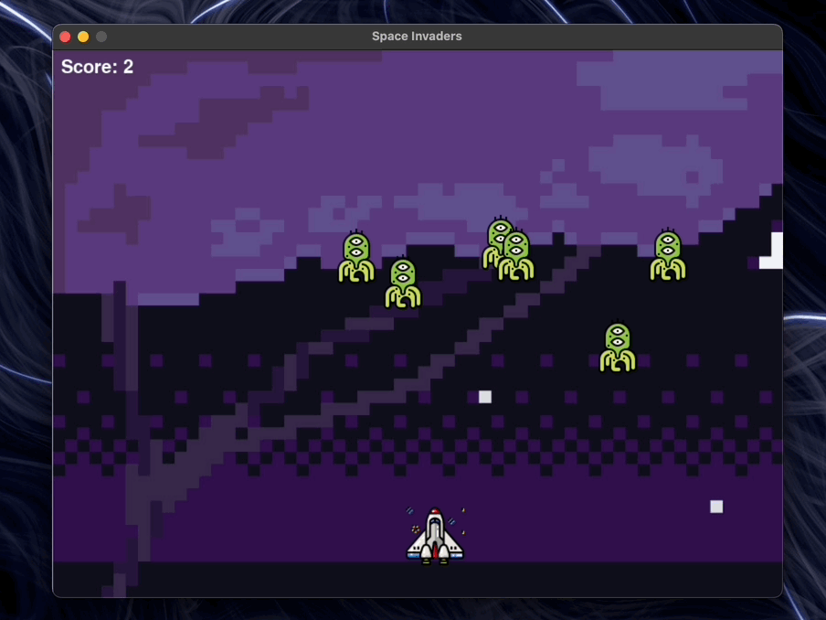

# 🚀 Space Invaders Game

## Overview

Space Invaders is a classic arcade-style game implemented in Python using the Pygame library. Blast your way through waves of alien invaders, score points, and avoid getting hit. Can you defend the Earth?



## Table of Contents

- [Prerequisites](#prerequisites)
- [Installation](#installation)
- [How to Play](#how-to-play)
- [Features](#features)
- [Controls](#controls)
- [Acknowledgments](#acknowledgments)
- [License](#license)

## Prerequisites

- **Python 3.x**
- **Pygame library**

## Installation

1. **Clone the repository:**

   ```bash
   git clone https://github.com/fxrrhxn/Classic-Space-Invaders.git
   ```

2. **Navigate to the project directory:**

   ```bash
   cd space-invaders
   ```

3. **Install the required dependencies (Pygame):**

   ```bash
   pip install pygame
   ```

## How to Play

- **Run the game:**

  ```bash
  python main.py
  ```

- **Controls:**

  - **⬅️ Left Arrow Key:** Move the player spaceship to the left.
  - **➡️ Right Arrow Key:** Move the player spaceship to the right.
  - **🚀 Space Bar:** Shoot bullets.

- **Gameplay:**
  - Control your spaceship, shoot down alien invaders, and avoid enemy attacks.
  - Score points for each successful hit.
  - The game ends if an alien reaches your spaceship.



## Features

- **Player Spaceship:**

  - Navigate left and right to dodge enemies and projectiles.
  - Shoot bullets to destroy alien invaders.

- **Alien Invaders:**

  - Wave-based enemy movements.
  - Increasing difficulty as you progress.

- **Scoring System:**

  - Earn points for each successful enemy hit.

- **Game Over Screen:**
  - Displays when the game ends.

## Controls

- **⬅️ Left Arrow Key:** Move spaceship left.
- **➡️ Right Arrow Key:** Move spaceship right.
- **🚀 Space Bar:** Shoot bullets.

## Acknowledgments

- Original Space Invaders concept by Tomohiro Nishikado.
- Pygame library for game development in Python.

## License

This project is licensed under the MIT License - see the [LICENSE](LICENSE) file for details.
